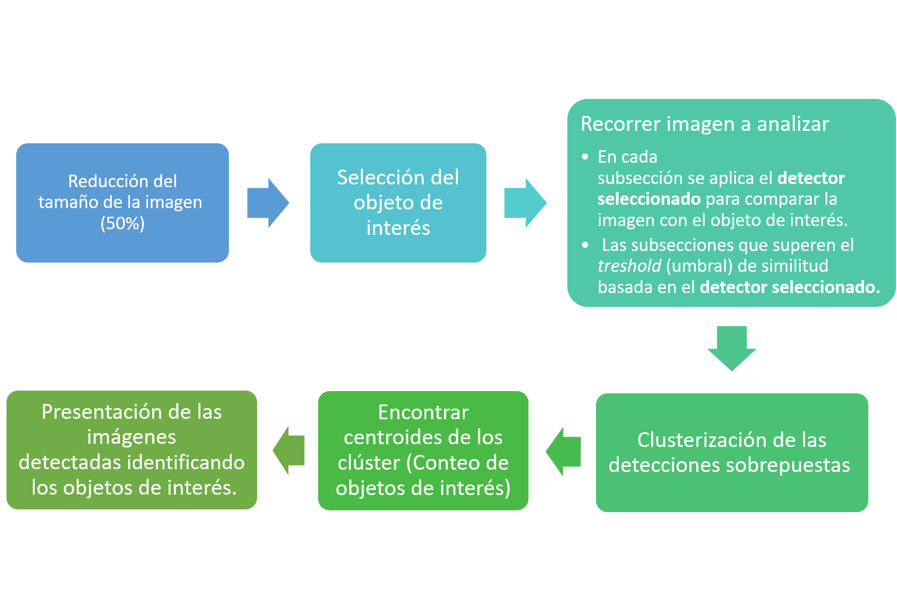
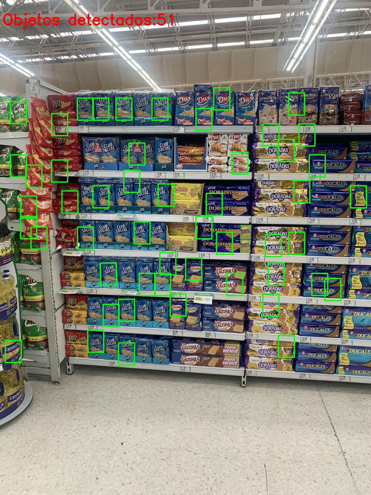

# Prueba Técnica - Deasarrollador Machine Learning (Visón por computador)

El objetivo de éste proyecto es mostrar diferentes técnicas y algoritmos para trabajar con diferentes imágenes y detectar objetos en ella.

-----------------
## Tecnología escogida
* **Lenguaje de programación:** El leguaaje de programación seleccionado es **Python** en su version 3.6. La razón de ésta selección es la versatilidad del lenguaje, su simplicidad  y compatibilidad con diversas librerías relacionadas al área del machine learning, deep learning y visión de máquina.
* **Principales Librerías/Frameworks utilizados:**
    * **OpenCV:** Utilizada ampliamente en el área de visión de máquina y procesamiento de imágenes. Posee diversas funcionalidades que facilitan el trabajo con imágenes, principalmente en métodos tradicionales (no deep learning).
    * **Numpy:** Libería matemática, relacionada con operaciones de álgebra lineal. Permite el diferentes operaciones con matrices y vectores.
    * **Matplotlib:** Librería de visualización de datos e imágenes.
    * **Scikitlearn:**  Utilizada ampliamente en el área del machine learning, ya que permite un uso sencillo de múltiples algoritmos.
    * **Tensorflow/ Keras:** Biblioteca enfocada a las redes neuronales.

-----------------

## Algoritmos Utilizados 
Se han propuesto diferentes algoritmos que indican diferentes formas de interacción con las imágenes entregadas. 

Se han utilizado 2 tipos de aproximaciones al trabajo con las imágenes, basadas en técnicas convencionales de *Machine Learning* y utilizando una aproximación basada en *Deep Learning* para análisis de imágenes con muy pocos datos-

### **Técnicas basadas en Machine Learning**

#### **1. Scale-invariant feature transform (SIFT)**
En este algoritmo se utiliza la técnica SIFT para extraer las características más relevantes de uma imagen patrón a detectar.

  

El detector SIFT sigue la estructura:

    1. Obtener las imagenes de referencia y comparación
    2. La imagen de comparación es convertida a escala de grises
    3. Se crea el detector de objetos SIFT
    4. Se obtienes los descriptores y puntos clave en cada una de las imagenes
    5. Se define el Fast Library for Aproximate Nearest Neighbors Matcher, el cual contiene algoritmos optimizados para una búsqueda rápida de nearest neighbors (vecinos cercanos) en bases de datos con alta dimensionalidad. Se especifica un árbol de decisión como clasificador y su número de checks (100).
    6. Se utiliza el classificador propuesto para comparar los descriptores de las figuras en estudio.
    7. Se comparan los resultados obtenidos utilizando la métrica de Lowe (Lowe rate), que compara la distancia entre los descriptores. Se almacenan los mejores resultados.
    
En este programa se propuso:

    1. Reducción del tamaño de la imagen en un 50% (reducción de costo computacional).
    2. Recortar el área de interés (donde se encuentre el objeto que quiero detectar).
    3. Se recorre la imagen de estudio en pequeñas secciones. 
        3.1 En cada subsección se aplica el detector SIFT para comparar cada subsección en estudio y la imagen de referencia.
        3.2 Las subsecciones que superen el treshold (umbral) de similitud basada en el SIFT son almacenadas.
    4. Clusterización de detecciones sobrepuestas en un mismo objeto. Es utilzado el algoritmo BIRCH (Balanced Iterative Reducing and Clustering using Hierarchies) debido as su efficiencia de uso de memoria y a su capacidad de selección de número de clústers basado en distancia (relacionada con el objeto de interés a ser detectado).
    5. Con el número de clústers encontrado, cada clúster es promediado para encontrar un valor medio por clúster (una forma de centroide del clúster) e indicar así la ubicación de cada uno de los objetos detectados.
    6. Los clústers son mostrados en la imagen de estudio, identificando el objeto de interés.

#### **2. Oriented FAST and Rotated BRIEF (ORB)**

En este algoritmo se utiliza la técnica ORB para extraer las características más relevantes de una imagen patrón a detectar. 
Su ventaja con respecto a SIFT es su mayor eficiencia computacional. 

  

El detector ORB sigue la estructura:

    1. Obtener las imagenes de referencia y comparación
    2. La imagen de comparación es convertida a escala de grises
    3. Se crea el detector de objetos ORB, definiendo 10000 características a ser retenidas y su pirámide de escala (1.4) [representación multiescala de una sóla imagen].
    4. Se obtienes los descriptores y puntos clave en cada una de las imagenes
    5. Se define el matcher de Fuerza Bruta o BFMatcher para comparar el descriptor de una característica de un conjunto y se compara con las demas características utilizando en este caso la distancia de Hamming. Los resultados son organizados de acuerdo a su desempeño (menor distancia es mejor) y se devuelve el número de características similares encontradas.
    
En este programa se propuso:

    1. Reducción del tamaño de la imagen en un 50% (reducción de costo computacional).
    2. Recortar el área de interés (donde se encuentre el objeto que quiero detectar).
    3. Se recorre la imagen de estudio en pequeñas secciones. 
        3.1 En cada subsección se aplica el detector ORB para comparar cada subsección en estudio y la imagen de referencia.
        3.2 Las subsecciones que superen el treshold (umbral) de similitud basada en el ORB son almacenadas.
    4. Clusterización de detecciones sobrepuestas en un mismo objeto. Es utilzado el algoritmo BIRCH (Balanced Iterative Reducing and Clustering using Hierarchies) debido as su efficiencia de uso de memoria y a su capacidad de selección de número de clusters basado en distancia (relacionada con el objeto de interés a ser detectado).
    5. Con el número de clústers encontrado, cada clúster es promediado para encontrar un valor medio por clúster (una forma de centroide del clúster) e indicar así la ubicación de cada uno de los objetos detectados.
    6. Los clústers son mostrados en la imagen de estudio, identificando el objeto de interés.

#### **3. ORB y SIFT (Técnica Híbrida)**

En este algoritmo se propone utilizar las técnicas ORB y SIFT para extraer las características más relevantes de una imagen patrón a detectar.
Se toman la ventaja computacional de ORB para detectar posibles subsecciones candidatas, y la buena capacidad de comparación de SIFT para avalar si esas subsecciones pertenecen o no al patrón detectado.

El detector ORB y SIFT siguen las estructuras mostradas previamente.
    
En este programa se propuso:

    1. Reducción del tamaño de la imagen en un 50% (reducción de costo computacional).
    2. Transformación a escala de grises.
    3. Recortar el área de interés (donde se encuentre el objeto que quiero detectar).
    4. Se recorre la imagen de estudio en pequeñas secciones. 
        4.1 En cada subsección se aplica el detector ORB para comparar cada subsección en estudio y la imagen de referencia.
        4.2 Las subsecciones que superen el treshold (umbral) de similitud basada en el ORB son almacenadas.
    5. Clusterización de detecciones sobrepuestas en un mismo objeto. Es utilzado el algoritmo BIRCH (Balanced Iterative Reducing and Clustering using Hierarchies) debido as su efficiencia de uso de memoria y a su capacidad de selección de número de clusters basado en distancia (relacionada con el objeto de interés a ser detectado).
    6. Con el número de clústers encontrado, cada clústers es promediado para encontrar un valor medio por clúster (una forma de centroide del clúster) e indicar así la ubicación de cada uno de los objetos detectados.  
    7. Cada uno de Los clústers encontrados es analizado utilizando SIFT para detectar si efectivamente los clústers indicador por ORB pertenecen al conjunto de imágenes con alta similitud a la imagen patrón.
    8. Los clústers aceptados por el algoritmo SIFT son mostrados en la imagen base.

### **Técnica basada en *Deep Learning***

#### **4. Inceptionv3 utilizada como una *Siamese Network***
En este algoritmo se utiliza el concepto de transfer learning para comparar 2 imágenes en un espacio de características generado por la red neuronal pre-entrenada Inceptionv3, la comparación es hecha con la distancia del coseno entre las características obtenidas.

# **Add Siamese Network image**

El detector basado en Inceptionv3 sigue la estructura:

    1. Cargar el modelo Inceptionv3 sin incluir sus capas finales.
    2. Ajustar la imagen al tamaño de la red neuronal Inceptionv3
    3. Obtener el vector de características dado por el modelo Inceptionv3
    4. Comparar las características utilizando la distancia del coseno 
    5. Se regresa un valor de 0-1 que indica la mayor o menor similaridad de las imágenes.
    
En este programa se propuso:

    1. Reducción del tamaño de la imagen en un 50% (reducción de costo computacional).
    2. Recortar el área de interés (donde se encuentre el objeto que quiero detectar).
    3. Se recorre la imagen de estudio en pequeñas secciones. 
        3.1 En cada subsección se aplica el detector Inceptionv3 para comparar cada subsección en estudio y la imagen de referencia.
        3.2 Las subsecciones que superen el treshold (umbral) de similitud basada en el detector Inceptionv3 son almacenadas.
    4. Clusterización de detecciones sobrepuestas en un mismo objeto. Es utilzado el algoritmo BIRCH (Balanced Iterative Reducing and Clustering using Hierarchies) debido as su efficiencia de uso de memoria y a su capacidad de selección de número de clústers basado en distancia (relacionada con el objeto de interés a ser detectado).
    6. Con el número de clústers encontrado, cada clúster es promediado para encontrar un valor medio por clúster (una forma de centroide del clúster) e indicar así la ubicación de cada uno de los objetos detectados.
    7. Los clústers son mostrados en la imagen de estudio, identificando el objeto de interés.

-----------------

## Diagrama

El siguiente diagrama muestra la secuencia lógica utilizada en la implementacón de los algoritmos presentados.

  

-----------------

## Problemas Encontrados y como fueron solucionados
1. Las imagenes .HEIC (propios de dispositivos Apple - iPhone) presentaron una limitación para su uso en Windows y Linux.

    **Solucion:** Se convirtieron las imágenes a un formato compatible (PNG). Se desarrolló un script que permitió esa conversión utilizando Google Colab (script ubicado en /src/HEIC2JPG_colab.py ).
2. Sobreposición de múltiples áreas de detección para la identificación de un mismo objeto.

    **Solucion:** Se utilizó un algoritmo de *clusterización* basado en la distancia entre objetos para agrupar las detecciones contiguas.

3. Selección de la imágen patrón (ejemplo) y el *treshold* (umbral) que permiten la detección de items similares. Diferentes patrones y *tresholds* pueden cambiar completamente el resultado del algoritmo.

    **Solucion:** Se buscó  de forma heurística un patrón y un *treshold* que mostrase buenos resultados.

4. Selección de la imágen patrón (ejemplo) para detectar los demás items similares, diferentes patrones en la misma imagen cambian el resultado del algoritmo.

    **Solucion:** Se buscó  de forma heurística un patrón que mostrase buenos resultados.

5. Baja cantidad de imágenes en la base de datos.

    **Solución:** Uso de técnicas basadas en pocos datos como SIFT, ORB y estructuras de redes neuronales del tipo *one-shot learning*.

-----------------
## Posibles mejoras a los algoritmos propuestos
* Mejoras del algoritmo de clusterización para obtener mejores resultados en la detección.
* Ajuste de hiperparámetros (constantes y métodos) de los algoritmos propuestos, ya que estas mejoras finas pueden mejorar considerablemente el desempeño del detector.
* Uso de técnicas híbridas (uso de *ensemble methods*) para mejorar el desempeño de los algoritmos.
* Detección de espacios vacíos en los estantes.
* Uso de ténicas más complejas y recientes.
* Recolección de mayores cantidad de imágenes para proponer un abordaje más moderno del problema (deep learning).
* Identificar y almacemar la interacción de los clientes con los productos.
* Identificar la no existencia de productos en determinada área.
* Identificar robos de productos.
* Crear modelos de predicción para la demanda de productos, identificar tendencias de consumo y optimizar pedidos/stock.
* En el caso de la *Siamese Neural network basada en Inceptionv3* se puede mejorar considerablemente el desempeño del clasificador haciendo *fine-tune* al modelo de *transfer learning* con un dataset más similar a los datos de interés.
* Modelo híbrido entre la *Siamese Neural network basada en Inceptionv3* y los modelos basados en técnicas clásicas.
* Implementación de técnicas como YOLO, R-CNN, Fater R-CNN con una mayor base de datos.

-----------------
## Soporte gráfico de los resultados
-----------------

### 1. Ejemplo simple - único ambiente

Detección y conteo de **UN** objeto dado

  

#### **1. Scale-invariant feature transform (SIFT)**

* La detección es correcta
* Trata de contar algunas cajas escondidas
* En 1 ocasión cuenta un ítem dos veces
* 304 objetos detectados antes de la clusterización
* 18 objetos detectados después de la clusterización

  

#### **2. Oriented FAST and Rotated BRIEF (ORB)**

* Algoritmo rápido.
* El detector detecta la marca "Colgate" confundiendo los productos
* Presenta inconvenientes con algunas cosas en el fondo y de lugares contiguos (3 falsos positivos)
* 76 objetos detectados antes de la clusterización
* 24 objetos detectados después de la clusterización

  

#### **3. ORB y SIFT (Técnica Híbrida)**

* Algoritmo que combina rapidez y buena clasificación.
* Parece robusto al ruido y otros.
* Detección correcta de las caras del producto
* 76 objetos detectados antes de la clusterización
* 16 objetos detectados después de la clusterización

  

#### **4. Inceptionv3 utilizada como una *Siamese Network***

* Algoritmo lento
* Detección correcta de los objetos
* Errores en la clusterización 
* 18 objetos detectados antes de la clusterización
* 13 objetos detectados después de la clusterización

  

-----------------

### 2. Ejemplos en otros ambientes

Detección y conteo de **UN** objeto dado en otros ambientes y otros objetos

  

#### **1. Scale-invariant feature transform (SIFT)**
Requirió una actualización del treshold y la clusterización

  

#### **2. Oriented FAST and Rotated BRIEF (ORB)**

Por el tipo de objeto no funcionó, requiere mayores ajustes.

  

#### **3. ORB y SIFT (Técnica Híbrida)**
Por ser híbrido y al ORB no funcionar genera errores.

  

#### **4. Inceptionv3 utilizada como una *Siamese Network***

Resultados aceptables, pero se puede mejorar si se ajusta.

  

------------

Detección y conteo de **UN** objeto dado en otros ambientes y otros objetos

  

#### **1. Scale-invariant feature transform (SIFT)**
Se puede mejorar ajustando el algortimo, pero los resultados son aceptables.

  

#### **2. Oriented FAST and Rotated BRIEF (ORB)**

El algoritmo necesita un ajuste muy detallado y fino, cambiando el treshold se puede obtener un resultado aceptable, con muchos falsos negativos, que pueden ser mejorados.

  

#### **3. ORB y SIFT (Técnica Híbrida)**
Después de ajustar levemente los tresholds de los detectores se puede ver un resultado bueno que puede ser mejorado los diferentes parámetros de los detectores.

  

#### **4. Inceptionv3 utilizada como una *Siamese Network***
Resultado razonable, puede ser mejorado modificando el treshold y mejorando el transfer learning de la red con información similar a la que se está evaluando.                                                                          

  

### 3. Multiples objetos

En todos los casos la detección de múltiples objetos equivale a seleccionar los diferentes objetos en la foto y ejecutar los diferentes detectores.
Es igual que en todos los casos anteriores, sólo unificando los resultados, los resultados de la detección de un objeto no afecta la detección de otro.
